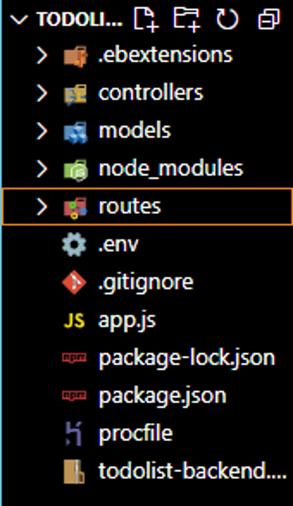
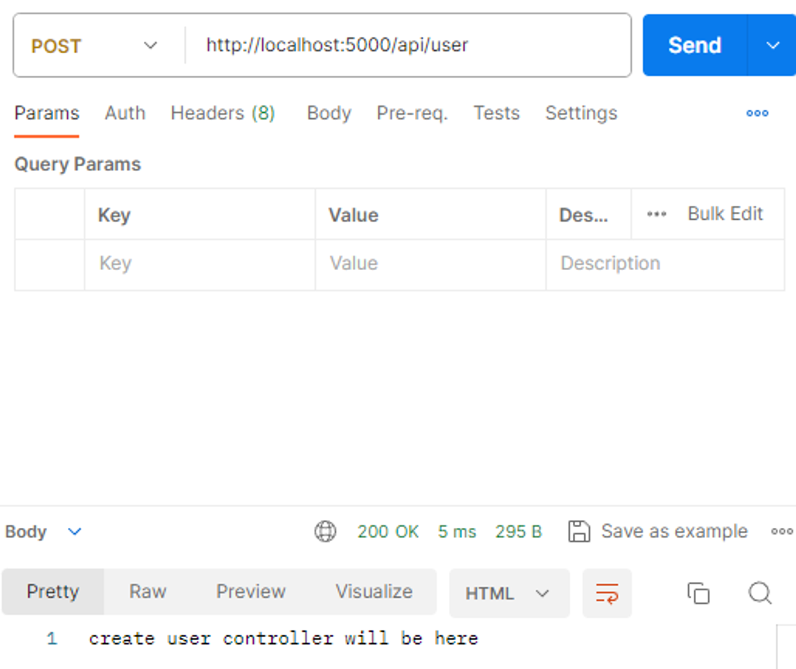
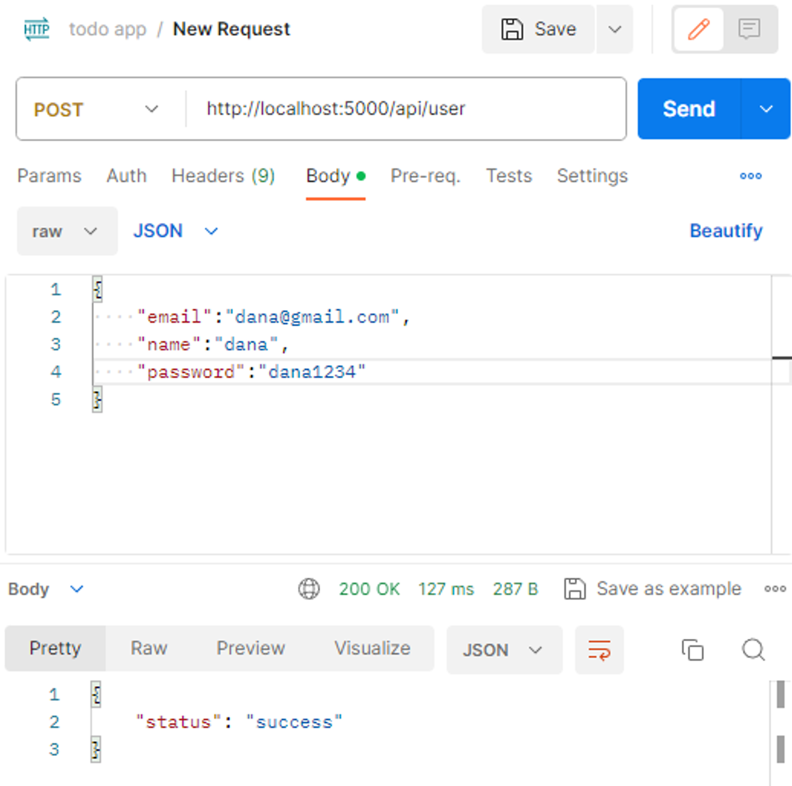
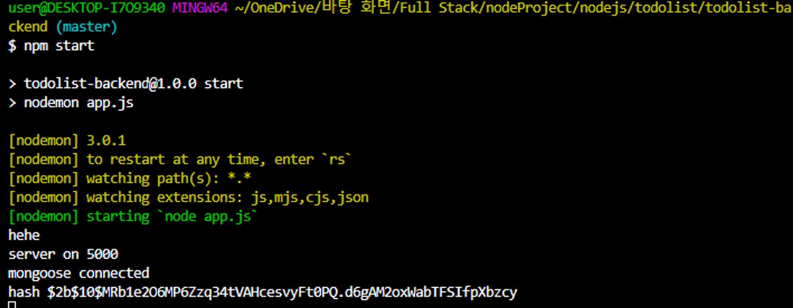
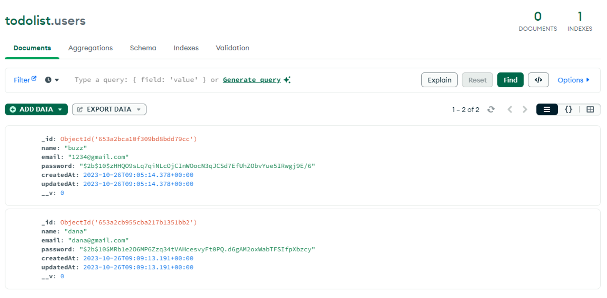
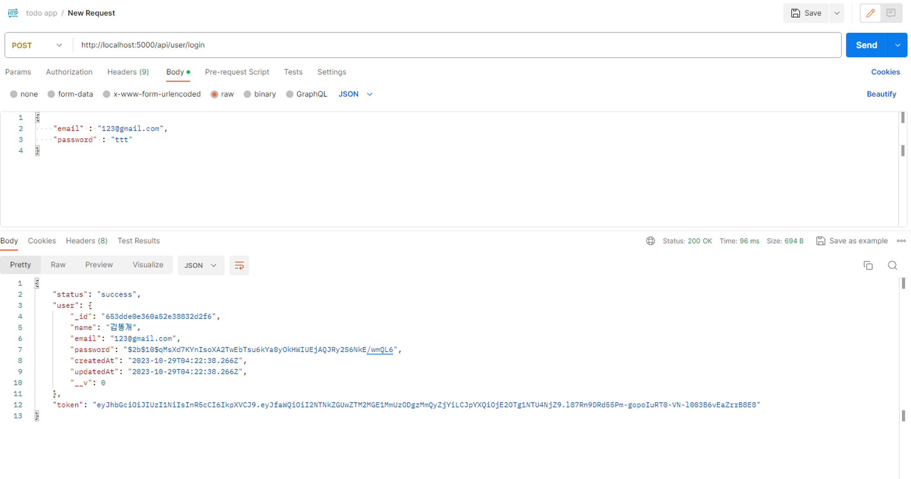

# 회원가입 만들기

---

백엔드에서의 회원가입 만들기.

## 회원가입 **Backend** 만들기

### 생각해야하는 로직

1. 유저의 정보를 받기 (이메일, 비밀번호, 유저이름 받을 예정)
2. 그 정보를 데이터베이스에 저장
3. 정보중에 비밀번호는 암호화를 해서 저장

### 개발 순서

1. 라우터 : 프론트엔드가 정보를 어디 주소로 보내야 할지 알아야 하기 때문에 라우터를 구성.
2. 모델 : 데이터를 받아서 저장하는 곳.
3. 데이터 저장 (가입유무 확인, 비밀번호 암호화)
4. 응답을 보냄.



### 라우터 만들기

---

- `/routes` 경로에 `user.api.js` 파일을 생성해준다.

index.js

```jsx
//import 및 주소를 설정
const userApi = require("./user.api")

router.use("/user", userApi)
```

user.api.js

```jsx
//express 서버, 라우터 생성
const express = require("express")
const router = express.Router()

// 회원가입 endpoint
router.post("/", (req, res) => {
  res.send("create user controller will be here")
})

module.exports = router
```

라우터가 정상 작동하는지 확인



### 모델 만들기

---

- `/model` 경로에 `User.js` 생성

/model/User.js

```jsx
//몽고디비 불러오기, 스키마 설정
const mongoose = require("mongoose")
const Schema = mongoose.Schema

//userSchema 생성해주기 Schema = 작업지시서
const userSchema = Schema(
  {
    name: {
      type: String,
      required: true,
    },
    email: {
      type: String,
      required: true,
    },
    password: {
      type: String,
      required: true,
    },
  },
  { timestamps: true }
)

// 모델 만들기
const User = mongoose.model("User", userSchema)

module.exports = User
```

### 데이터 저장

---

- `/controllers/user.controller.js` 생성

`controllers/user.controller.js`

```jsx
const { Types } = require("mongoose")
const User = require("../models/User")
const bcrypt = require("bcrypt")
const saltRounds = 10

const userController = {}

userController.createUser = async (req, res) => {
  try {
    //프론트 엔드에서 정보 받아오기
    const { email, name, password } = req.body
    //이미 가입된 유저인지 체크, eamil => email:email (자바 스크립트 문법)
    const user = await User.findOne({ email })
    if (user) {
      throw "이미 가입이 된 유저 입니다"
    }
    //패스워드 암호화(bcrypt 라이브러리(npm 다운 받아야함))
    const salt = bcrypt.genSaltSync(saltRounds)
    const hash = bcrypt.hashSync(password, salt)
    console.log("hash", hash)
    const newUser = new User({ email, name, password: hash })
    await newUser.save()
    res.status(200).json({ status: "success" })
  } catch (error) {
    res.status(400).json({ status: "fail", error })
  }
}

module.exports = userController
```

`routers/user.api.js`

```jsx
//express 서버, 라우터 생성
const express = require("express")
const router = express.Router()
const userController = require("../controllers/user.controller")

// 회원가입 endpoint
router.post("/", userController.createUser)

module.exports = router
```

router.post 부분을 model의 userController.createUser와 연결해준다.

- 포스트맨으로 API를 전송해본다.



> 여기서 req.body값이 전달이 안돼서 한참 헤맸지만, Body의 타입을 기본값인 TEXT에서 JSON으로 바꿔주니 전달이 잘 되었다.

- 백엔드 콘솔에서 hash(비밀번호 암호화)가 들어왔는지 확인해본다.



- 추가로 데이터베이스에도 정보가 들어왔는지 확인!



# 로그인 만들기

---

백엔드에서의 로그인 만들기.

## 로그인 **Backend** 만들기

### 생각해야하는 로직

1. 유저가 로그인을 하면 데이터베이스에서 로그인 정보를 확인.
2. 정보가 없다면, 로그인 거부
3. 정보가 맞다면, 유저정보 + 토큰을 준다.
4. 프론트엔드는 토큰을 사용하여 로그인 유지.

### 개발 순서

1. 라우터 설정
2. 받은 이메일과 패스워드 정보 읽어오기.
3. 받은 이메일정보가 디비에 있는지 확인.
4. 이메일 정보에 해당하는 비밀번호가 맞는지 확인.
5. 맞다면, 유저정보 + 토큰을 보냄
6. 틀리면, 에러메시지 보냄

### 라우터 설정

---

routes/user.api.js

```jsx
//express 서버, 라우터 생성
const express = require("express")
const router = express.Router()
const userController = require("../controllers/user.controller")

// 회원가입 endpoint
router.post("/", userController.createUser)
//로그인 정보는 get에 가깝다는 생각이 들지만, url설정을 유저의 아이디로
//하고싶지 않기 때문에 post를 사용한다.
//그리고 get은 req,res를 이용해 정보를 주고받지는 못한다.
router.post("/login", userController.loginWithEmail) //loginWithEmail 생성 예정

module.exports = router
```

login 라우터를 만들어 준다.

### 토큰 생성

---

토큰 발행을 위한 jsonwebtoken 설치

```bash
$ npm install jsonwebtoken
```

.env

```bash
JWT_SECRET_KEY=나만의 Secret key 설정 (아무거나 가능)
```

models/User.js

```bash
const jwt = require("jsonwebtoken");
require("dotenv").config();
const JWT_SECRET_KEY = process.env.JWT_SECRET_KEY;

//token생성
userSchema.methods.generateToken = function () {
  const token = jwt.sign({ _id: this._id }, JWT_SECRET_KEY);
  return token;
};

module.exports = User;
```

### 정보확인 및 에러전달

---

controllers/user.controller.js

```jsx
userController.loginWithEmail = async (req, res) => {
  try {
    const { email, password } = req.body
    const user = await User.findOne({ email })
    if (user) {
      // req에서 보낸 비밀번호와 디비에 암호화된 비밀번호 비교
      const isMatch = await bcrypt.compareSync(password, user.password)
      if (isMatch) {
        //토큰 발행하기
        const token = await user.generateToken()
        return res.status(200).json({ status: "success", user, token })
      }
    }
    throw new Error("아이디 또는 비밀번호가 일치하지 않습니다")
  } catch (error) {
    res.status(400).json({ status: "fail", message: error.message })
  }
}
```

- postman 확인



- 토큰 유효기간 설정

models/User.js

```jsx
const token = jwt.sign({ _id: this._id }, JWT_SECRET_KEY, {
  expiresIn: "1d",
})
```

- 불필요한 정보 빼주기

controllers/user.controller.js

```jsx
const user = await User.findOne({ email }, "-createdAt -updatedAt -__v")
```

- 비밀번호 정보도 빼주기

비밀번호 정보는 로그인 할 때 뿐만이 아니라 어떠한 형태의 프론트엔드에서 요청하는 유저정보에서도 빼야하기 때문에 따로 설정을 이와같이 해서 영구적으로 제거를 해준다.

modles/User.js

```jsx
// 어디서 유저정보를 요청하던 pasword정보 지워주기
userSchema.methods.toJSON = function () {
  const obj = this._doc
  delete obj.password
  return obj
}
```

이 내용은 코딩알려주는누나 풀스택 강의를 보면서 공부한 내용입니다!!

관심있으신분들은 [코딩알려주는누나](https://codingnoona.thinkific.com/) 강의를 참고하세요!!

출처: [코딩알려주는누나](https://codingnoona.thinkific.com/) 풀스택 강의
